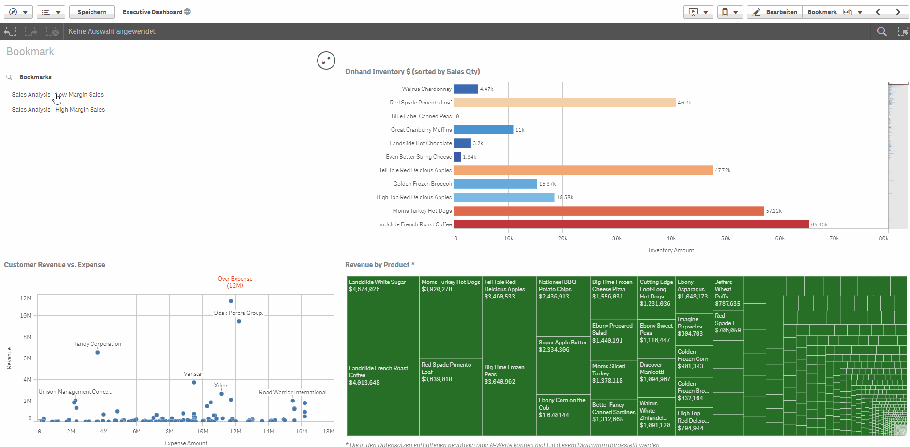
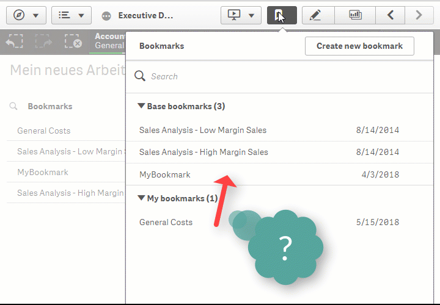

# Bookmark Extension

This extension was developed, for blind users to handle bookmarks with full keyboard control and full JAWS support.
Now we add more and more features like publishing of bookmarks, so that it get more interested for everybody.

In addition to that, it is now available to share your own bookmarks in a published Application with the other users. 

## Intro

## Settings

### Sorting

The default sort order of the bookmarks is by creation Date. You can change this to sort your Bookmarks alphabetically.

### Appearance

#### Accessibillity
In the accessibillity options you can switch the use of shortcuts from the default values to customise shortcuts. The recommendation ist to use the combination of "strg + alt + {any keycode}", so that you do not get in truble with screenreaders shortcuts.

#### Configuration
Shortcut                |  Description
------------------------|--------------------------------------------
title                   | enter a title to be shown in the extension
bookmark type           | enter the type of the bookmark you want to show (default is bookmark)
use sheet               | create the bookmark with using the sheet id in the configuration
show focused elements   | mark the elements which have the focus with a black border
loglevel                | define the log level to be used

## Install

### binary

1. [Download the ZIP](https://m.sense2go.net/extension-package) and unzip
2. Qlik Sense Desktop
   Copy it to: %homeptah%\Documents\Qlik\Sense\Extensions and unzip
3. Qlik Sense Entripse
   Import in the QMC

### source

1. Clone the Github Repo into extension directory
2. Install [nodejs](https://nodejs.org/)
3. Open Node.js command prompt
4. npm install
5. npm run build
